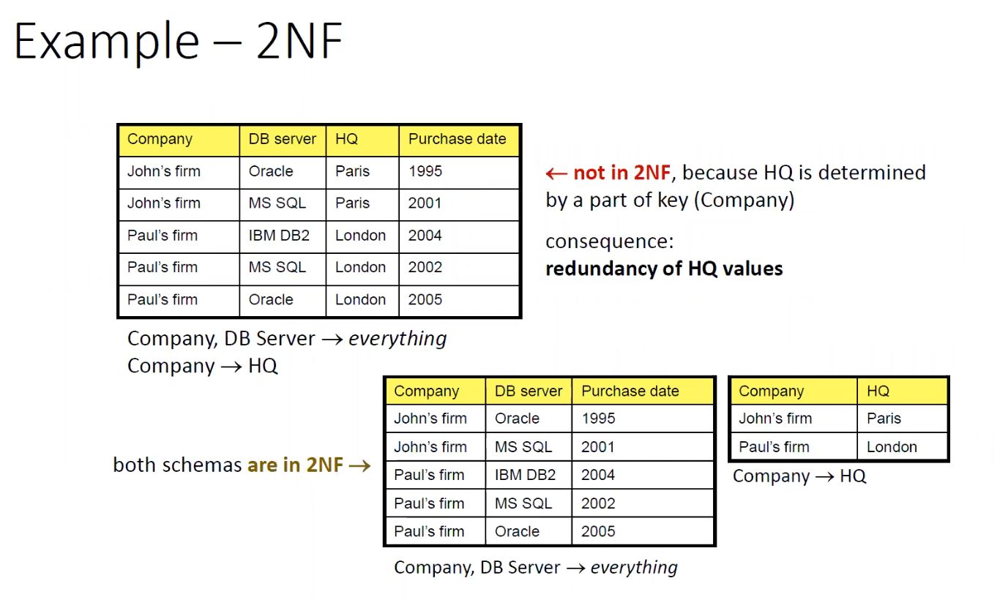
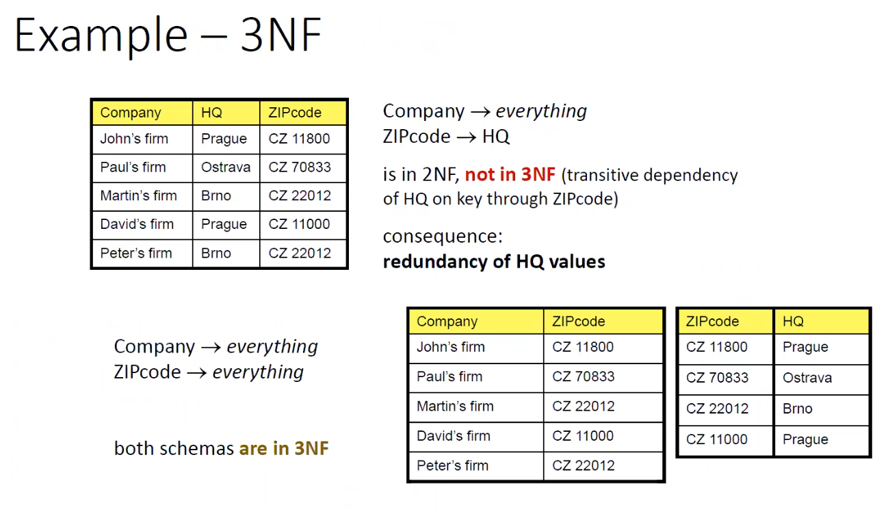
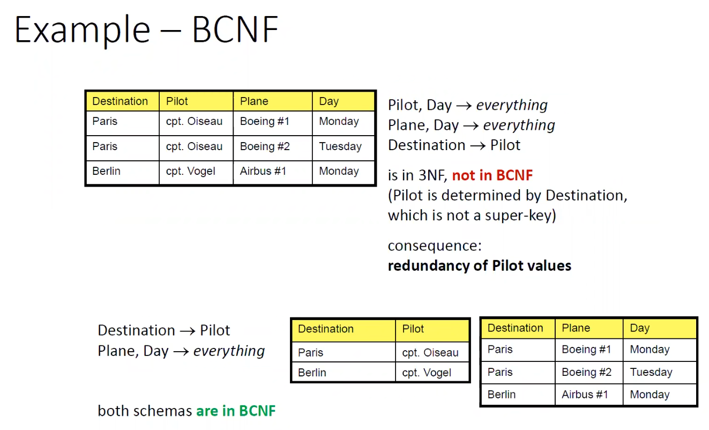
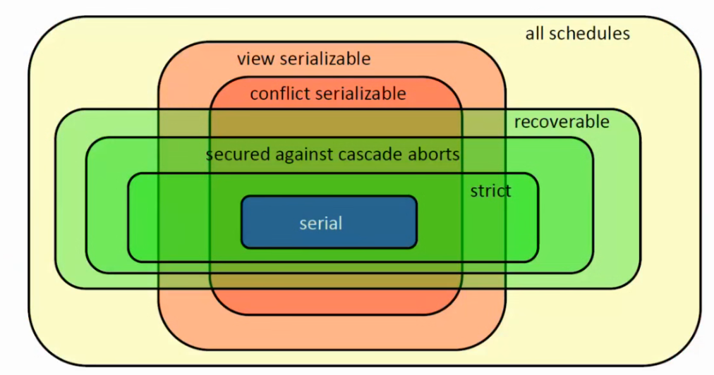
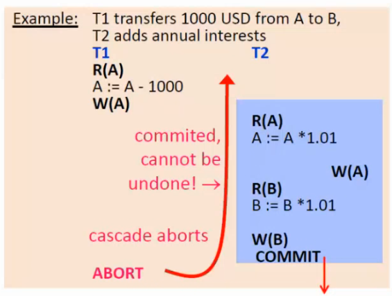

# Contents

# Intro
Předmět je ukončen zápočtem a zkouškou. Oba se získají pomocí písemných testů. Zápočtový písemný test se skládá z první části sylabu (ER, UML, SQL), zkouška pak z druhé části (relační algebra, funkční závislosti, transakce, ...)

## Sylabus
V době mého učení na zkoušku bylo celkem složité se zorientovat, co všechno předmět obsahuje a jaké všechny přednášky jsou k dispozici (přednášky se mi kryli s jiným, pro mě důležitějším předmětem, nu což). Níže jsem se tedy rozhodla přiložit seznam, který je, alespoň dle mého bádání, kompletní a správný. Nahrávky některých přednášek byly navíc dostupné pouze ve velmi zvláštních codecích, proto pro každou přednášku naleznete i odkaz na transkódovaná videa v codecu AV1, který by vám měl každý moderní přehrávač úspěšně přehrát :).

|#|Název|[Slidy](https://drive.proton.me/urls/0GKKS644TM#NcqfpfpMkBSw)|[Přednáška](https://drive.proton.me/urls/0GKKS644TM#NcqfpfpMkBSw)|
|---|---|---|---|
1|Conceptual modelling|||
2|Logical relational data model, OCL|||
3|SQL - definice modelu, manipulace dat|||
4|SQL - dotazy, tvorba pohledů|||
5|Relational algebra|||
6|Data normalisation - functional dependencies, normal forms|||
7|Transactions|||
8|Multimedia retrieval|||
9|Modern database systems|||
10|Database data structures, optimilization|||

# Relační algebra

# Normalizace dat
*Motivace*: Překladem konceptuálního modelu do relačního nám mohou vzniknout relace, které nejsou normalizované. Laicky řečeno to znamená, že některé informace ohledně jejich prvků ukládáme víckrát, než je potřeba. To pak vede k zbytečně velké velikosti databáze na disku, problémům při ukládání nových, aktualizování nebo mazání již vytvořených prvků apod. Řešením je data tzv. normalizovat.

*Ukázka z prezentace*: Číslo zaměstnance je klíč, navíc pozice udává plat. Zde nastává hned několik problémů.
1. Nic nám nebrání, abychom zaměstnanci dali jiný plat, než je normální, vzhledem k jeho pozici (ať už omylem či úmyslně...).
2. Při editaci platů musíme aktualizovat všechny zaměstnance, kteří na dané pozici pracují.
3. Při smazání (v tomto případě nejspíš vyhození) posledního zaměstnance s danou pozicí ztrácíme informaci o platu dané pozice.
4. V neposlední řadě i laikovy dojde, že ukládáním platu pro každého zaměstnance plýtváme místem na disku. 

Ideálně bychom tedy chtěli oddělit informaci ohledně platu pozic do separátní relace (naše původní tabulka porušuje 3NF, tudíž chceme problematickou závislost přendat do jiné relace, ale o tom později).

## Funkční závislosti
Nechť máme množinu funkčních závislostí FD pro nějakou relaci R. Funkční závislosti značíme jako $X \rightarrow Y$, což nám říká, že všechny atributy v Y závisí na X. Jinak řečeno, hodnoty atributů v X nám jednoznačně určují hodnoty atributů v Y. Pokud si tedy zvolíme nějaké platné hodnoty X, tak máme jednoznačně definované hodnoty Y a vyhledávací prostor se nám zúží na zbylé atributy.

Pokud máme $a \in A, X \rightarrow a$, pak mluvíme o elementárních funkčních závislostech (na pravé straně je pouze jeden atribut).

Pokud platí ekvivalence - tedy $X \rightarrow Y \land Y \rightarrow X$, pak říkáme, že X a Y jsou funkčně ekvivalentní.

### Armstrongovy axiomy
Nechť máme R(A, FD) a $X, Y, Z \in A$. Zavedeme si následující axiomy:
1. axiom podmnožiny - $Y \subseteq X \implies X \rightarrow Y$
2. tranzitivita - $X \rightarrow Y \land Y \rightarrow Z \implies X \rightarrow Z$
3. kompozice - $X \rightarrow Y \land X \rightarrow Z \implies X \rightarrow YZ$
4. dekompozice - $X \rightarrow YZ \implies X \rightarrow Y \land X \rightarrow Z$

Pomocí těchto axiomů budeme provádět další výpočty.

### Atributový uzávěr
V mnoha případech se nám hodí vědět, které všechny atributy jsou dány hodnotami pro nějaké atributy z množiny X. Těmto atributům se říká atributový uzávěr X a značí se $X^+$.

Jeho výpočet je snadný. Začneme s množinou X (platí triviálně $X \rightarrow X$). Poté se podíváme, zda neexistuje nějaká taková relace, jejíž levá strana je podmnožina našeho doposud spočítaného uzávěru a pravá strana naopak není podmnožinou našeho uzávěru. Pokud nějaká taková relace existuje, přidáme její pravou stranu do našeho uzávěru. Pokud ne, tak máme výsledný uzávěr a výpočet ukončíme.

*Příklad*: Nechť máme množinu $FD = \{a \rightarrow b, bc \rightarrow d, bd \rightarrow a\}$. Chceme spočítat uzávěr nad {b,c}. Začneme tedy se samotným {b,c} a aplikujeme iteraci našeho algoritmu. Zjistíme, že $bc \rightarrow d$. Přidáme tedy d do našeho uzávěru a pokračujeme. Použijeme $bd \rightarrow a$ ($\{bd\} \subseteq \{bcd\}$) a přidáme a. Zbývá nám poslední nepoužítá závislost, kterou však nevyužijeme, jelikož b je podmnožina našeho uzávěru. Nemáme jak pokračovat, a tak výpočet ukončíme. Výsledný uzávěr je tedy $\{a,b\}^+ = \{a,b,c,d\}$

### Uzávěr funkčních závislostí
Množina všech funkčních závislostí, které lze z naší původní množiny závislostí odvodit pomocí Armstrongových axiomů. Značíme ji $F^+$. Velikost množiny všech možných závislostí na naší relaci je exponenciální (obecně $2^{|A|}$, včetně prázdné množiny).

V některých případech se nám hodí odpověď na otázku, zda závislost patří do $F^+$. V takovém případě můžeme spočítat $F^+$ a jednodušše se podívat, zda patří. Spočítat takové pokrytí je však náročné a hlavně zbytečné, protože nám stačí zjistit, zda $Y \in X^+$. Platí tedy, že $\{X \rightarrow Y\} \in F^+ \iff Y \in X^+$

### Redukce závislostí
Někdy se může stát, že ne všechny atributy na levé straně závislosti jsou skutečně potřeba. Pokud chci zjistit, zda je nějaký atribut redundantní, jednodušše ho ze závislosti odstraním a zeptám se, zda je tato zmenšená závislost v $F^+$ (zda je pravá strana podmnožina atributového uzávěru levé strany).

Tento algoritmus pak mohu použít pro redukci celé závislosti tím, že jednoduše proiteruji všechny atributy na levé straně závislosti a aplikuji na ně zmíněný algoritmus.

Pokud se budu chtít zbavit redundantních závislostí, jednoduše odstraním danou závislost z mé původní množiny závislostí (řekněmě $X \rightarrow Y$) a podívám se, zda pořád existuje v $F^+$. To udělám tak, že opět spočítám atributový uzávěr levé strany. Musím si však dát pozor, abych pro výpočet nepoužila mnou odebranou závislost (pak bych logicky dostala pokaždé kladný výsledek).

### Cover
Cover (česky prokrytí, ale moc se nepoužívá) $G$ je nějaká množina funkčních závislostí na stejné relaci, jako $F$, která nám udává stejné podmínky ($F^+ = G^+$). Přitom definujeme několik typů:
- kanonické pokrytí - obsahuje pouze elementární závislosti
- neredundantní pokrytí - pokrytí, které neobsahuje žádné redundantní závislosti (záleží na pořadí, v jakém závislosti odstraňujeme -> existuje alespoň jedno takové pokrytí)

#### Minimální pokrytí
Minimální pokrytí nějaké množiny závislostí je takové pokrytí, které je kanonické a neobsahuje žádné redundantní závislosti. Pro jeho nalezení:
1. rozložím funkční závislosti na elementární (takové, které na pravé straně obsahují pouze jeden atribut)
2. **nejprve** odstraním redundantní atributy na levých stranách
3. až poté odstraním redundantní závislosti

## Klíče
> [!info]
> Tuto sekci již nejspíš nikdy nedokončím, doporučuji se podívat na zápisky od [Víta Kološe](https://www.vitkolos.cz/node/view/notes-ipp/main/semestr5/databazove-systemy/zkouska.md) :).

## Normálové formy
### První normálová forma (1NF)
*[Více zde.](https://en.wikipedia.org/wiki/First_normal_form)*

Udává, že relace je skutečně dvourozměrná tabulka. Každý atribut tedy musí obsahovat nějakou skalární hodnotu, nemůže obsahovat např. seznam. Jinak řečeno, tabulka je v první normálové formě, pokud množina povolených hodnot pro žádný její atribut neobsahuje další relace.

Pokud nějaká relace skutečně potřebuje pro nějaký její atribut uložit seznam relací (např. projekty zaměstnance), 1NF udává, že je nutné tuto relaci oddělit do separátní tabulky (tabulka projektů) a záznamy propojit pomocí cizích klíčů (foreign keys).

### Druhá normálová forma (2NF)
*[Více zde.](https://en.wikipedia.org/wiki/Second_normal_form)*

Udává, že se nesmí stát, aby nějaký neklíčový atribut (atribut, který se nenachází v žádném z klíčů) závisel pouze na části jakéhokoli klíče. Relace **musí** zároveň být v první normálové formě.

### Třetí normálová forma (3NF)
*[Více zde.](https://en.wikipedia.org/wiki/Third_normal_form)*

Udává, že žádný neklíčový atribut nemůže tranzitivně záviset na žádném z klíčů. Relace **musí** zároveň být v druhé normálové formě.

Alternativní definice udává, že pro každou funkční závislost takovou, že $R(A, F) : X \rightarrow a, X \subseteq A, a \in A$ platí alespoň jedna z následujících podmínek:
- $a \subseteq X$ - platí triviálně
- X je nadklíč (super-key)
- a je klíčový atribut

### Boyce-Codd normálová forma

Stejná, jako 3NF, akorát bez poslední podmínky. Zbylých dvou se nejde zbavit (první platí triviálně, druhá plyne z definice klíče).

# Transakce
Transakce v kontextu databázových systémů jsou nějaké posloupnosti operací, které klientský kód potřebuje vykonat na uložených datech (read, write, delete atd.). Nastává otázka, v jakém pořadí dané operace (a s tím i celé transakce jako takové) provést. Nejjednodušší řešení je samozřejmě jednotlivé transakce spustit *sériově* za sebou s tím, že jakákoliv permutace dané množiny transakcí je platná. (Nevede však ke stejnému výsledku!) To je však, co se týče rychlosti, velmi neoptimální, proto bychom chtěli operace jednotlivých transakcí spustit nějak promíchaně.

*Poznámka*: Bystrá duše si může povšimnout, že relativní pořadí operací jejich celkový počet nikterak neovlivní. Může se však stát, že klient mezi dvěma operacemi provadí nějakou svoji aplikační logiku, která trvá nějakou delší dobu (například čeká na uživatelův input). Pokud bychom transakce spouštěli sériově, všichni, na které se ještě nedostala řada, by museli čekat, než daná aplikace provede svoji logiku (v našem případě než daný uživatel poskytne input), a to je logicky velmi nežádoucí.

## ACID
Nejen v souvislosti s transakcemi se ve světě databázových systémů často používá zkratka ACID, která vyjadřuje základní vlastnosti, které bychom od takové databáze logicky očekávali:
1. *Atomic* - transakce by měli být tzv. atomické, jinak řečeno by měli být považovány za jeden ucelený blok, ze kterého se buďto provedou všechny operace, nebo žádné (all or nothing).
2. *Consistency* - stav databáze musí být platný před i po skončení transakce (např. musí dodržovat vzdálené klíče, unikátnost hodnot atributů atd.)
3. *Isolation* - transakce by se neměli ve svém průběhu nikterak ovlivňovat, změny by měly být vidět až po commitu transakce, která je provedla.
4. *Durability* - výsledky transakcí by měli být permanentní, nemělo by se např. stát, že výpadek elektřiny způsobí ztrátu jejich změn (jinak řečeno výsledky transakcí by se měli ukládat na disk).

## Konfliktní dvojice
Pokud operace pracují se stejnými datovými jednotkami, může dojít k tomu, že se budou navzájem ovlivňovat, což, jak jsme zmínili v předchozí části, je nežádoucí. Definují se tzv. *konfliktní dovjice*, které nám nějaký způsobem způsobojí neplechy (první a druhá operace jsou z jiných transakcí):
- R(A) x R(A) - v pořádku
- R(A) x W(A) - neopakovatelné čtení (Může způsobovat neplechu, pokud např. nejdříve v T1  přečteme stav nějaké účtu, v T2 převedeme peníze z onoho účtu na jiný, a pak spočítáme úroky na všech účtech a dokončíme první transakci. To nám způsobí, že úroky na prvním účtě budou vyšší, než by ve skutečnosti měly být, poněvadž má první transakce načtený stav prvního účtu před a druhého účtu po převodu.) 
- W(A) x R(A) - čtení špinavých (neuložených) dat
- W(A) x W(A) - přepsání špinavých dat

## Uspořádatelnost
Uspořádatelnost (nebo také serializovatelnost) nějaké posloupnosti operací zadaných transakcí definuje, zda je konečný stav databáze po provedení operací v takovém pořádí shodný s nějakým seriovým provedení transakcí. Pokud bychom však chtěli zjistit, zda nějaké takové provedení existuje, museli bychom v nejhorším případě spočítat všechna seriová provedení, kterých je $|T|!$. Existuje proto několik odlišných definic serializovatelnosti, které se tento výpočet snaží zrychlit.

### Konfliktová uspořádatelnost
Neboli conflict-serializability. Bere v potaz množinu konfliktních dvojic, které se v daném provedení transakcí vyskytují. Pokud se množiny konfliktních párů dvou rozvrhů rovnají, říkáme, že jsou *konfliktově ekvivalentní*. Pokud je rozvrh konfliktově ekvivalentní s nějakým sériovým rozvrhem, říkáme, že je *konfliktově uspořádatelný*. 

Konfliktová uspořádatelnost implikuje uspořádatelnost (avšak pozor, není s ní ekvivalentní!). Nebere v potaz zrušení transakcí (abort) - rozvrh tedy nemusí být zotavitelný - ani dynamické tabulky (vkládání či mazání prvků).

Konfliktová uspořádatelnost se počítá pomocí tzv. precedenčního grafu, kde vrcholy značí **potvrzené transakce** a orientované hrany konfliktní páry mezi danými transakcemi, přičemž hrana jde vždycky z té transakce, která svoji operaci pro daný pár provedla dříve. Pokud je daný graf acyklický - můžeme ho topologický uspořádat a dostat rozvrh - znamená to, že je rozvrh konfliktově uspořádaný.

### Pohledová uspořádatelnost
Neboli view-serializability. Bere v potaz, jakou hodnotu bude mít proměnná při jejím čtení a jakou hodnotu bude mít na konci. Říká, že daný rozvrh je pohledově ekvivalentní s jiným rozvrhem, pokud:
1. Pokud transakce čte prvotní hodnotu nějaké proměnné, musí ji číst i v druhém rozvrhu (formálně: Transakce $T_i$ čte prvotní hodnotu proměnné X v prvním rozvrhu pouze pokud ji čte i ve druhém rovzrhu.)
2. Pokud čte operací $O_i$ nějakou hodnotu nějaké proměnné produkovanou operací $O_j$, musí ji číst i v druhém rozvrhu (formálně: Operace $O_i$ v transakci $T_i$ čte hodnotu proměnné X produkovanou operací $O_j$ v transakci $T_j$ pouze pokud ji čte i v druhém rozvrhu.)
3. Pokud daná proměnná skončí s hodnotou od stejné transakce v obou rozvrzích (formálně: Transakce $T_i$ zapisuje finální hodnotu proměnné X v prvním rozvrhu pouze pokud ji zapisuje i ve druhém rozvrhu.)

Podobně jako předtím, rovrzh je pohledově serializovatelný, pokud je pohledově ekvivalentní s nějakým sériovým rozvrhem.

Pohledová uspořádatelnost je ekvivalentní s uspořádatelností. Konfliktová uspořádatelnost implikuje pohledovou uspořádatelnost, ale ne naopak.

## Obnovitelnost
U rozvrhů nás také zajímá, zda jsou tzv. obnovitelné v případě ukončení některé z transakcí. Pokud některá z transakcí čte nepotvrzená data, musí její potvrzení následovat po potvrzení čtených dat, jinak hrozí, že transakce, která data původně změnila, se ukončí, avšak druhá transakce již nepůjde vrátit zpátky, protože byla potvrzena.

## Protokoly
Tento kurz se zaměřuje především na zamykací protokoly, které pro svoji funkci využívají tzv. [zámky](#zámky).

### Zámky
Stejně jako v ostatních paralelních systémech se i zde uplatňuje princip zámků. Konkrétní zámek vždycky patří nějaké transakci a odkazuje na nějaký objekt (relaci, prvek relace, ...).

Obecně se rozlišují dva typy - **sdílené** (read) zámky a **exkluzivní** (write) zámky. Jak již jejich názvy napovídají, sdílené zámky poskytují dané transakci přístup ke čtení daného objektu. V jeden moment může více transakcí vlastnit sdílený zámek na konkrétní objekt. Exkluzivní zámky pak poskytují přístup k přepsání/aktualizaci daného objektu. V jeden moment může vlastnit exkluzivní zámek na konkrétní objekt maximálně jedna transakce, přitom žádná jiná na něj nemůže vlastnit sdílený zámek. 

Exkluzivní zámky tak zajišťují, že nám žádná jiná transakce nepřepíše námi přepsaná data, a že zároveň žádné jiné transakci neničíme nějaký interní stav. Klasické zámky naopak zajišťují, že nám žádná jiná transakce nepřepíše objekt a nezničí interní stav.

||Sdílené|Exkluzivní|
|--|--|--|
|Čtení|✅|✅|
|Psaní|❌|✅|
|Více zámků|pouze sdílené|❌|

### Two-phase locking (2PL)
Databázové systémy pak v komunikaci s klienty implementují požadavek na uzamykání objektů, se kterými bude daný klient interagovat. Ve volné implementaci je však těžké zaručit, aby požadavek klient skutečně dodržel. Kvůli tomu se implementuje systém, ve kterém v okamžiku, kdy klient odemkne svůj první zámek, mu databáze už žádný další zámek nevydá. Díky tomu se transakce rozdělí na dvě fáze: uzamykací a odemykací (odtud název *two-phase locking*).

2PL implikuje konfliktovou uspořádatelnost.

Existují i striktní implementace, ve které databáze klientovi nepovolí odemykat jakékoliv zámky a všechny zámky, které si klient vyžádal, se odemknou až při ukončení transakce (ať už pozitivním, či negativním). Této implementaci se říká strict 2PL (S2PL).

### Deadlock
Deadlock je případ, ve kterém dvě a více transakcí čekají na odemknutí zdrojů, na který navzájem drží zámky, a tudíž ani jedna z transakcí nemůže pokračovat.

Pokud některá z transakcí trvá podezřele dlouho, databázový systém si toho může všimnout, otestovat graf závislostí a pokud v něm najde cyklus, zabít některou z transakcí na cyklu. Alternativně jde deadlockům předcházet prioritizací transakcí, např:
- wait-die - pokud si (např.) mladší transakce vyžádá zámek, který zrovna drží starší transakce, DBS ji zabije a restartuje
- wound-wait - pokud si (např.) starší transakce vyžadá zámek, který zrovna drží mladší transakce, zabije ji a restartuje, v opačném případě čeká na jeho uvolnění
 
# Multimedia retrieval
## Content-based similarity search model
Nechť máme databázi DB($f_e, \delta$), kde $f_e: DB \rightarrow U_d$ je funkce pro extrakci vlastností, která nám pro určitý záznam vrátí vektor vlastností, a $\delta: U_d \times U_d \rightarrow \mathbb{R}_o^+$ funkce, která nám pro dvojici vektoru vlastností vrátí hodnotu, která udává, jak moc jsou si dané vektory podobné.

Vektor vlastností je velmi obecná věc. Můžeme například chtít, aby jedna dimenze vektoru odpovídala tomu, zda se v obrázku nachází nějaká osoba. Náš systém pro detektování osob (předpoklad je tedy ten, že takovým systémem disponujeme), nám pak vrátí číslo mezi 0 a 1, které říká, jak moc si je systém jistý, že se v daném obrázku nějaká osoba nachází.

Tento systém podobnostních funkcí se pak většinou využívá pro vyhledávání pomocí referenčních obrázků, kdy se daný referenční obrázek srovná s obrázky v databázi, které se následně seřadí podle výsledné podobnosti. 

# Modern database systems
## No-SQL
Termín obecně používaný pro databázové systémy, které nepoužívají systém relací, jinak řečeno nepoužívají schéma. Obecně platí, že se tím lépe horizontálně škálují.

### Key-value store
Nejjednodušší No-SQL systém. Jedná se v podstatě o HashMapu, kde na jedné straně máme klíče a na druhé hodnoty. Většina systému pak implementuje základní operace typu získání hodnoty (get), přidání či nahrazení hodnoty (put) a smazání hodnoty (delete). Nejčastěji jsou hodnoty skaláry (boolean, čísla, stringy, ...), některé systémy pak dovolují ukládat i strukturovanější data (např. seznamy či JSON objekty), princip dvojice [klíč, hodnota] však zůstava stejný.

Mezi nejpopulárnější systémy tohoto typu patří např. [Redis](https://redis.io/).

### (Wide-)Column database
Mix key-value store a relačních databází. Definuje tabulky, ve kterých je každý řádek identifikovatelný pomocí jednoho klíče (podobně jako v key-value), avšak každý řádek může obsahovat odlišné sloupce. Obecně se však tabulky definují jako "třídy řádků", ve kterých se očekává, že budou mít až na pár vyjímek podobné sloupce (např. tabulka uživatelů).

Často se používají například na sběr událostí (event logging), CMS, blogy, apod. Mezi nejpopulárnější column database systémy patří např. [Cassandra](https://cassandra.apache.org/_/index.html).
