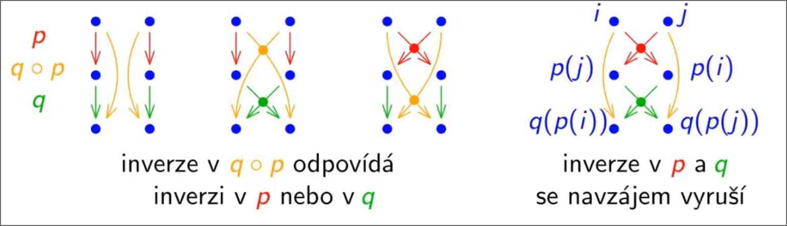

> [!alert]
> Nedoporučuji tyto poznámky používat pro vlastní potřeby. Místo toho se doporučji podívat např. na [skripta pana profesora Hladíka](https://www.ms.mff.cuni.cz/%7Esejkoraji/sbirka/zalohy/skripta_la.pdf) či na [skripta pana docenta Bečváře](https://www2.karlin.mff.cuni.cz/%7Ehalas/becvar_-_linearni_algebra.pdf). Víc materiálu je dostupných na [Matfyz wiki](https://wiki.matfyz.cz/NMAI057).

# Contents

# Intro

# Matice
## Druhy matic
> [!definition] Nulová matice
> Nulová matice $0_{m,n}$ je taková matice, která pro libovolné $m,n\in N$ splňuje $\forall i,j : (0_{m,n})_{ij} = 0$. Značí se též jen **0**.
> $$
> \begin{pmatrix}
> 0 & \dots & 0 \\
> \vdots & \ddots & \vdots \\
> 0 & \dots & 0
> \end{pmatrix}
> $$

> [!definition] Jednotková matice
> Jednotková matice $I_{n} \in R^{n\times n}$ je taková matice, která pro libovolné $n\in N$ splňuje $(I_n)_{ij} = 1$ právě když i = j, jinak $(I_n)_{ij} = 0$. Značí se též jen **I**.
> $$
> \begin{pmatrix}
> 1 & 0 & \dots \\
> 0 & 1 &  \\
> \vdots &  & \ddots
> \end{pmatrix}
> $$

# Theorems
> [!theorem]
> Inverzní matice splňuje, že $A^{-1}A = I_n$.
> > [!success] Solution
> > Nejprve ukážeme, že $A^{-1}$ je regulární. Pokud $A^{-1}x = 0$ má řešení, pak $x = I_nx = AA^{-1}x = A0 = 0$.  
> > Existuje tedy $(A^{-1})^{-1}$ a dostáváme $A^{-1}A = A^{-1}AI_n = (A^{-1}A)(A^{-1}(A^{-1})^{-1})$.

> [!theorem]
> Množina $S_n$ všech permutací na n prvcích společně s operací skládání tvoří symetrickou grupu $(S_n, \circ)$.
> > [!success] Solution
> > Nejprve ověříme, že operace skládání je na této množině uzavřená. Ověříme, že permutace je bijektivní:
> > - pro $\forall i,j \in {0, \dots, n} : i \neq j \implies p(i) \neq p(j) \implies q(p(i)) \neq q(p(j))$, permutace je tedy injektivní (prostá)
> > - $(\forall i \exists j : q(j) = i) \land (\forall j \exists k : p(k) = j) \implies (\forall i \exists k : q(p(k)) = i)$, permutace je tedy surjektivní (na)
> >
> > Snadno nahlédneme, že skládání permutací je zároveň asociativní. Množina všech permutací bude také obsahovat inverzní prvek ($p^{-1}$) a identitu (neutrální prvek, $id \in S_n : \forall i : id(i) = i$).

> [!theorem]
> Jakoukoliv permutaci lze rozložit na transpozice.
> > [!success] Solution
> > Cyklus $(1, \dots, k)$ lze rozložit např. podle: $(1, 2, \dots, k) = (1, k) \circ (1, 2, \dots, k - 1) = (1,k) \circ (1, k - 1) \circ (1, 2)$.

> [!theorem]
> Pro libovolné $p,q \in S_n : sgn(q\circ p) = sgn(p)*sgn(q)$.
> > [!success] Solution
> > Počet inverzí $(q\circ p) = in(p) + in(q) - 2|\{(i,j) : i < j \land p(i) > p(j) \land q(p(i)) < q(p(j))\}|$.
> > Nejprve sečteme všechny inverze v p, poté všechny inverze v q, a poté odstraníme inverze, které se vyskytují v p i q, jelikož se nám ve složené permutaci vyruší.
> >
> > 

> [!theorem]
> Pro $\forall p \in S_n : sgn(p^{-1}) = sgn(p)$.
> > [!success] Solution
> > $sgn(p^{-1} \circ sgn(p)) = sgn(p)sgn(p^{-1}) = sgn(id) = 1$.  
> > Jedničku můžeme dostat buďto vynásobením dvou 1 nebo dvou -1, platí tedy, že se musí rovnat.

## Tělesa
> [!theorem]
> $\forall a \in T : 0a = 0$.
> > [!success] Solution
> > $0a = 0a + 0 = 0a + (0a - 0a) = (0 + 0)a - 0a = 0a - 0a = 0$.

> [!theorem]
> $\forall a \in T : (-1)a = -a$.
> > [!success] Solution
> > $(-1)a = -1a + 0 = -1a + (1a - a) = (-1 + 1)a - a = 0a - a = -a$.

> [!theorem]
> Pokud $ab = 0 \implies a = 0 \lor b = 0$.
> > [!success] Solution
> > Pokud $a = 0 \implies ab = 0$, jinak existuje $a^{-1}$ takové, že $aa^{-1}b = 0 \implies 1b = 0 \implies b = 0$.  
> > Alternativně si můžeme rovnou říct, že $a \neq 0 \land b \neq 0 \implies \exists a^{-1}, b^{-1} \implies 1 = aba^{-1}b^{-1} = 0a^{-1}b^{-1} = 0$, což je spor.

> [!theorem]
> $Z_p$ je těleso právě tehdy, když p je prvočíslo.
> > [!success] Solution
> > - Dopřednou implikaci dokážeme tím, že pokud by p bylo složené, pak $\exists a,b : ab = p \equiv 0 (\bmod p)$. To však vede ke sporu s $ab = 0$.
> > - Zpětnou implikaci dokážeme tím, že najdeme inverzní prvek ke každému prvku, čili $\forall a \in \{1, \dots, p - 1\} \exists a^{-1} \in \{1, \dots, p - 1\} : aa^{-1} \equiv 1 (\bmod p)$. Nejprve najdeme takové zobrazení $f_a:\{1, \dots, p - 1\} \rightarrow \{1, \dots, p - 1\}$, takové, že $f_a(x) = (ax) (\bmod p)$. Pokud ke každému a existuje inverzní prvek, obor hodnot $f_a$ musí nutně obsahovat 1, jinak takový prvek neexistuje. Zobrazení tedy musí být surjektivní a jelikož je na konečné množině, musí být nutně injektivní. To dokážeme sporem: $\exists b,c : f_a(b) = f_a(c) \implies 0 = f_a(b) - f_a(c) \equiv ab - ac = a(b-c) (\bmod p)$. Tedy buď se jedno z $b,c = 0$ (což nejde, protože 0 se nenachází v $Z_p$), nebo a i (b-c) dělí p, což je spor s tím, že p je prvočíslo (a má tedy pouze triviální dělitele).

> [!theorem]
> Malá Fermatova věta: Pro prvočíslo p a $\forall a \in \{1, \dots, p - 1\}:a^{p-1} \equiv 1 (\bmod p)$.
> > [!success] Solution
> > Zobrazení $f_a : x \rightarrow ax$ je v $Z_p$ bijektivní. Proto platí $\def\zpl#1{\prod\limits_{x=1}^{p-1}#1} \zpl{x} = \zpl{f_a(x)} = \zpl{ax} = a^{p-1}\zpl{x}$

## Vektorové prostory
> [!theorem]
> $\forall v \in V, a \in T : 0v = a0 = 0$.
> > [!success] Solution
> > - $0v = 0v + 0 = 0v + (0v - 0v) = (0 + 0)v - 0v = 0v - 0v = 0$.
> > - $a0 = a0 + 0 = a0 + (a0 - a0) = a(0 + 0) - a0 = a0 - a0 = 0$.

> [!theorem]
> $\forall v \in V : (-1)v = -v$
> > [!success] Solution
> > - $(-1)v = -1v + 0 = -1v + (1v - v) = (-1 + 1)v - v = 0v - v = -v$.
> > - Alternativně si můžeme říct, že tvrdíme, že se jedná o opačný vektor, tudíž $v + (-1)v = 0$. Ověříme: $v + (-1)v = 1v + (-1)v = (1 - 1)v = 0v = 0$.

> [!theorem]
> $\forall v \in V, a \in T : av = 0 \implies a = 0 \lor v = 0$.
> > [!success] Solution
> > Buď se a = 0, pak tvrzení platí. Pokud nikoliv, pak musí existovat $a^{-1} \implies v = 1v = aa^{-1}v = a^{-1}0 = 0$.

> [!theorem]
> Průnik podprostorů: Nechť $(U_i, i \in I)$ je libovolný systém podprostorů prostoru V. Průnik tohoto systému $\bigcap\limits_{i\in I} U_i$ je také podprostorem V.
> > [!prove]
> > Ověříme, že W je uzavřen na operaci součtu a násobení.  
> > - $\forall u,v \in W : u, v \in W \implies \forall i \in I : u,v \in U_i \implies \forall i \in I : u + v \in U_i \implies u + v \in W$.  
> > - První implikace plyne z definice průniku, druhá z uzavřenosti vektorových prostorů nad součtem.
> > - $\forall t \in T, v \in W : v \in W \implies \forall i \in I : v \in U_i \implies \forall i \in I : tv \in U_i \implies tv \in W$.
> > - Opět první implikace plyne z definice průniku, druhá z uzavřenosti vektorových podprostorů nad skalárním součinem.

> [!theorem]
> Je-li V podprostorem W konečné dimenze, pak $dim(V) \leq dim(W)$.
> > [!prove]
> > Báze podprostoru V je nezávislá v prostoru W. Můžeme ji rozšířit na bázi prostoru W, avšak přitom můžeme vektory pouze přidávat, takže určitě musí platit, že $dim(V) \leq dim(W)$.

> [!theorem]
> Jsou-li U,V podprostory konečně generovaného prostoru W, pak $dim(U) + dim(V) = dim(U \cap V) + dim(span(U \cup V))$.
> > [!prove]

### Báze
> [!theorem]
> Jestliže C je konečná generující množina prostoru V a B je lineárně nezávislá množina vektorů z V, pak $|B| \leq |C|$.
> > [!prove]
> > Pro spor budeme předpokládat velikosti množin $|C| = n \land |B| = n+1$. Každý vektor z B si vyjádřím pomocí lineární kombinace vektorů z C (to mohu udělat, protože množina C generuje prostor V), dostanu tedy rovnici $b_i = \sum\limits_{i=1}^n a_ic_i \implies AC = B$, kde B a C jsou sloupcové matice vektorů B a C. Matice A bude mít n + 1 řádků a n sloupců, má tedy jeden lineárně závislý řádek, čili původní množina B má jeden lineárně závislý vektor.

> [!theorem]
> Lineární kombinace vektorů z báze B prostoru V tvořící libovolný vektor v z V je jednoznačná.
> > [!prove]
> > $v = \def\vektorsum#1{\sum\limits_{i=1}^n #1} \vektorsum{a_ib_bi} = \vektorsum{a'_ib_i} \implies 0 = v - v = \vektorsum{a_ib_i} - \vektorsum{a'_ib_i} = \vektorsum{(a_i - a'_i)b_i} \implies a_i = a'_i$.

### Věta o výměně
> [!theorem] Theorem: Lemma o výměně
> Nechť C generuje vektorový prostor V nad T, $c \in C, v \in V$. Pokud lze vektor v zapsat jako lineární kombinaci vektorů z C, v níž u c je nenulový koeficient, tak množina $(C \setminus c) \cup v$ generuje V. Formálně: $(v = \sum\limits_{i=1}^{n} a_ic_i \land a_j \neq 0) \implies (span((C \setminus c_j) \cup v) = V)$. 
> > [!prove]
> > - $v = a_1c_1 + \dots + a_nc_n \implies c_j = \frac{1}{a_j}(v - \sum\limits_{i\neq j}a_ic_i)$
> > - Následně si zapíšu $u \in V$ jako lineární kombinaci vektorů z C, kde za $c_j$ dosadím výraz výše. Dostávám rovnici, kterou upravím následovně:
> > $$
> > \begin{align}
> > \sum\limits_{i=1} b_ic_i = b_1c_1 + \dots + b_jc_j + \dots + b_nc_n \\
> > b_1c_1 + \dots + b_j(\frac{1}{a_j}(v - \sum\limits_{i\neq j}a_ic_i)) + \dots + b_nc_n \\
> > b_1c_1 + \dots + \frac{b_j}{a_j}v - \frac{b_j}{a_j}\sum\limits_{i\neq j} a_ic_i + \dots + b_nc_n \\
> > \frac{b_j}{a_j}v + \sum\limits_{i \neq j} (b_i - \frac{b_j}{a_j}a_i)c_i
> > \end{align}
> > $$
> > V poslední úpravě si uvědomím, že ve (3) mám dvě sumy, jednu rozepsanou a jednu zkrácenou. Obě však obsahují pouze $\forall i, i \neq j : c_i$, pouze s jinými koeficienty. Sepíšu je tedy do jedné sumy a dostávám upravený poslední řádek. (Pokud se učíte z prezentací pana profesora Fialy, vězte, že jeho značení je obráceně - iteruje přes j a cílové c značí indexem i.)

> [!theorem] Theorem: Steinitzova věta o výměně
> Nechť B je konečná lineárně nezávislá množina ve vektorovém prostoru V a C generuje V. Pak existuje D taková, že:
> - $span(D) = V$
> - $B \subseteq D$
> - $|D| = |C|$
> - $D \setminus B \subseteq C$
> > [!prove]
> > Dokážeme podle indukce přes $|B \setminus C|$. Pokud se $B \setminus C = \emptyset$, poté D = C. Jinak zvolíme libovolné b z B, které neleží v C, a položíme $B' = B \setminus b$. Protože množina B' je lineárně nezávislá, podle indukčního předpokladu existuje D' pro B' a C taková, že:
> > - $span(D') = V$
> > - $B' \subseteq D'$
> > - $|D'| = |C|$
> > - $D' \setminus B' \subseteq C$  
> >
> > Následně použijeme lemma o výměně pro b a D'. Protože B je lineárně nezávislá, je $a_i \neq 0 : d_i \in D' \setminus B$. Potom $D = (D' \setminus d_i) \cup b$ splňuje všechny čtyři vlastnosti.

> [!theorem]
> Je-li vektorový prostor konečně generován, pak jakoukoli lineárně nezávislou množinu lze rozšířit na bázi.
> > [!prove]
> > Stačí D (generující množinu) zúžit na lineárně nezávislou při zachování B.

> [!theorem]
> Pokud je vektorový prostor konečně generován, pak všechny jeho báze mají stejnou mohutnost.
> > [!prove]
> > Mějme báze B, C prostoru V, pak
> > - B nezávislá, C generuje V $\implies |B| \leq |C|$
> > - C nezávislá, B generuje V $\implies |C| \leq |B|$  
> > $\implies |B| = |C|$

### Prostory určené maticí
