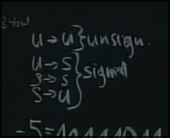

# Contents

# Intro

# Čísla
## Celá čísla
### Záporná čísla
V dnešní době se používá převážně two's complement, nicméně je dobré si pro vysvětlení, proč se používá zrovna tento systém, ukázat všechny různé způsoby, které se v historii používali a poukázat na jejich negativa.

**Signed magnitude**

V tomto systému se záporná čísla reprezntují jednodušše tím, že MSb se využije jako indikátor, zda se jedná o kladné (0) či záporné číslo (1) (můžeme to chápat jako vlajku, která říká, zda číslo obsahuje minus).

$$
\begin{align}
5 &= 00000101 \\
-5 &= 10000101
\end{align}
$$

Tento systém má však mnoho nevýhod. Nemůžeme například využít již zadefinované aritmetické operace či operace porovnávání. V praxi se tak často nevyužívá (i když s konceptem jakýchsi vlajek, které o dané hodnotě indikují danou věc, se ještě určitě setkáme).

**One's complement**

V tomto systému jednodušše vezmeme binární reprezentaci daného čísla a obrátíme hodnoty všech bitů (0 na 1 a 1 na 0). Číslo 5 bychom tedy reprezentovali následovně:

$$
\begin{align}
5 &= 00000101 \\
-5 &= 11111010
\end{align}
$$

Operace porovnání nám teď funguje mezi dvěma zápornými čísly (vskutku -5 (11111010) > -6 (11111001)). Porovnání mezi kladnými a zápornými čísly nám však stejnou operací pořád nefunguje. Museli bychom tedy pořád implementovat novou operaci (a to nechceme, jelikož cílíme na co nejmenší počet operací / co nejlevnější procesory). Aritmetické operace nám však již plně fungují.

Navíc, objevuje se zde problém tzv. dvou nul (se kterým se ještě setkáme u čísel s desetinnou čárkou). Pokud znegujeme všechny bity v nule (00000000), vyjde nám (11111111), což jsou binárně rozdílná čísla, pro nás však znamenají totéž (0 = -0). Máme tím pádem dva způsoby, jak reprezentovat to stejné číslo, což není úplně ideální.

**Two's complement**

Problém dvou nul nás vede k tzv. two's complement. Uvědomíme si, že se nabízí triviální řešení našeho problému - jednodušše k naší záporné nule přičteme 1, čímž dostáváme opět nulu (1, která nám přetekla, jednodušše zahodíme). Pokud to uděláme pro všechna čísla, aritmetické operace se nám nerozbijí.

$$
\begin{align}
5 &= 00000101 \\
-5 &= NOT(00000101) + 1 = 11111010
\end{align}
$$

# Přenos informace
## Sběrnice
### RS-232

### USB

### I2C
- multimaster - dovoluje více zařízením fungovat v režimu master (avšak pořád platí, že v jednu chvíli může po sběrnici probíhat pouze jedna point-to-point komunikace)

# Procesory
## Srovnání
|OP|x86 / x86-64|ARM|Microcontrollers|6502|
|---|:---:|:---:|:---:|:---:|
|mul x|✅|✅ dražší, ❌ levnější|✅ dražší, ❌ levnější|❌|
|div x|✅|✅ dražší, ❌ levnější|❌|❌|
